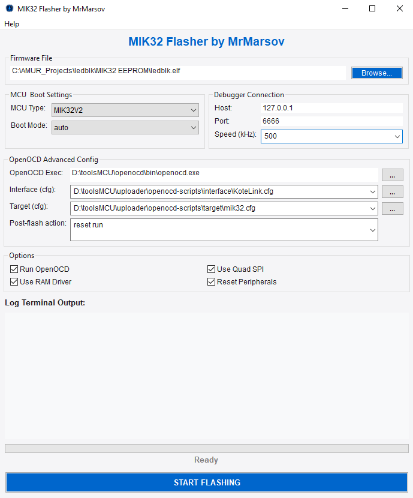
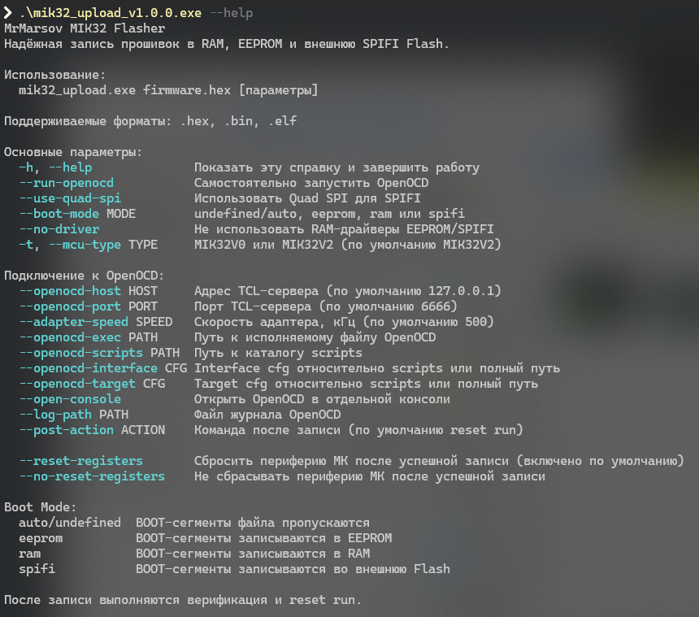

# MIK32 Flasher by MrMarsov

**Утилита для записи и верификации прошивок МИК32 через OpenOCD**

---

<p align="center">
  
</p>

<p align="center">
  
  
</p>

MIK32 Flasher записывает и верифицирует прошивки для МИК32 через OpenOCD: в RAM, EEPROM или внешнюю SPIFI Flash. Утилита может запускать OpenOCD автоматически или подключаться к уже работающему серверу.

## Скачать

Готовые сборки публикуются в GitHub Releases:

```text
Mik32_upload_v1.0.0.exe
MIK32_Uploader-x86_64_v1.0.0.AppImage
```

Контрольные суммы SHA-256 опубликованы в [checksums.txt](checksums.txt). Файл можно положить рядом со скачанными release assets и проверить их командой ниже.

Перед запуском можно проверить файл по SHA-256 и сверить опубликованную проверку:

* Windows EXE: [VirusTotal report](https://www.virustotal.com/gui/file/4470fed452f1ef0e9ba1cbf78211f6f7b349b2f806bf78a7b52b4eb0f30c750b)
* Linux AppImage: [VirusTotal report](https://www.virustotal.com/gui/file/e20de51d972366e11f397c7b5b6dab003cda035576f6f2c7a6711286af18646a)
* Подробности: [SECURITY.md](SECURITY.md)

> [!IMPORTANT]
> Windows SmartScreen или Microsoft Defender могут показывать предупреждение для новых неподписанных сборок. Это не означает автоматически наличие вируса: проверяйте, что файл скачан из этого репозитория, а SHA-256 совпадает с опубликованным.

## Быстрый старт

1. Выберите файл прошивки `HEX`, `BIN` или `ELF`.
2. Выберите `MCU Type` и `Boot Mode`.
3. Если OpenOCD нужно запускать из программы, оставьте `Run OpenOCD` включенным.
4. Проверьте `interface/target cfg` и скорость отладчика.
5. Нажмите `START FLASHING`. После записи выполняется `verify`, затем `Reset Peripherals` и `Post-flash action`.

## Интерфейс

<p align="center">
  
  
</p>

## Основной функционал

1. **Прошивка МИК32:** запись firmware в RAM, EEPROM или внешнюю SPIFI Flash.
2. **Проверка записи:** после прошивки выполняется `verify`.
3. **Работа с OpenOCD:** автоматический запуск OpenOCD или подключение к уже работающему серверу.
4. **Гибкие режимы загрузки:** `auto`, `ram`, `eeprom`, `spifi`.
5. **Reset Peripherals:** возврат периферии МК к reset-состоянию после успешной прошивки.
6. **Post-flash action:** запуск, переход по адресу, завершение OpenOCD или пользовательская Tcl/OpenOCD-команда.

## Документация

* [Установка](docs/installation.md)
* [Подробное использование](docs/usage.md)
* [Командная строка](docs/cli.md)
* [Автотесты прошивки](tests/README.md)
* [Поддерживаемые устройства](docs/supported-devices.md)
* [Релизы и версии](docs/releases.md)
* [Решение проблем](docs/troubleshooting.md)
* [FAQ](docs/faq.md)
* [Поддержка проекта](SUPPORT.md)
* [Проверка безопасности](SECURITY.md)
* [Лицензионные условия](EULA.md)
* [Сторонние компоненты](THIRD_PARTY_LICENSES.md)

## Основные поля

* `Firmware File` - путь к прошивке. Файл можно выбрать кнопкой `Browse` или перетащить мышкой в поле.
* `MCU Type` - версия микроконтроллера. Обычно для актуальных плат используется `MIK32V2`.
* `Speed (kHz)` - скорость JTAG/SWD-адаптера для OpenOCD. Если связь нестабильна, уменьшите скорость, например до `100` или `200 kHz`.
* `Boot Mode` - режим размещения BOOT-сегментов: `auto`, `ram`, `eeprom` или `spifi`.

## OpenOCD

`Run OpenOCD` включает автоматический запуск OpenOCD перед прошивкой и остановку после завершения.

Если `Run OpenOCD` выключен, программа подключается к уже запущенному OpenOCD по `Host` и `Port`. По умолчанию используется `127.0.0.1:6666`.

## Проверка SHA-256

Linux:

```bash
sha256sum -c checksums.txt
```

Windows PowerShell:

```powershell
Get-FileHash -Algorithm SHA256 .\mik32_upload_v1.0.0.exe
Get-FileHash -Algorithm SHA256 .\MIK32_Uploader-x86_64_v1.0.0.AppImage
```

## Структура репозитория

```text
.github/                  Шаблоны issue, release template и проверки репозитория
docs/                     Пользовательская документация
icons/                    Иконки проекта
images/                   Изображения для README и документации
packaging/                Чеклисты подготовки Windows/Linux сборок
tests/                    Публичные автотесты записи и верификации прошивок
checksums.txt             SHA-256 суммы опубликованных бинарников
SECURITY.md               Проверка файлов, SHA-256, VirusTotal и предупреждения SmartScreen/Defender
SUPPORT.md                Контакты, поддержка и обратная связь
EULA.md                   Условия использования бинарных сборок
NOTICE.md                 Краткое уведомление о распространении
THIRD_PARTY_LICENSES.md   Информация о сторонних компонентах
```

## 🎛 Отладочная плата

На изображениях в начале страницы представлена бюджетная отладочная плата для микроконтроллера МИК32 «Амур», произведенная **ООО «КоТе»**.

Плата идеально подходит для быстрого старта разработки и прототипирования. Основные преимущества:

* Встроенный программатор
* Адресный и обычный светодиод на борту
* Flash-память

Для заказа платы и уточнения любых деталей по отладке обращайтесь по электронной почте: **[master-gsm@list.ru](mailto:master-gsm@list.ru)**

## Поддержка проекта

Проект развивается в непростых условиях. Если MIK32 Flasher оказался полезен, буду рад любой поддержке: обратной связи, сообщениям об ошибках, идеям, моральной поддержке или донату.

Связаться со мной можно по почте: [tim.marsov@gmail.com](mailto:tim.marsov@gmail.com)

Поддержать финансово:

* Boosty: [boosty.to/mrmarsov](https://boosty.to/mrmarsov)
* YooMoney: [yoomoney.ru/fundraise/1IDQG8PSQV7.260615](https://yoomoney.ru/fundraise/1IDQG8PSQV7.260615)

## Распространение

MIK32 Flasher распространяется как готовое бинарное приложение. Исходный код проекта является закрытым и не публикуется.

Использование предоставленных бинарных сборок разрешено в виде "как есть". Распространение, модификация, обратная разработка или коммерческое распространение требуют отдельного разрешения автора.

This repository contains public releases and documentation.
The source code is proprietary and is not licensed for public use.

Подробнее см. [EULA.md](EULA.md) и [NOTICE.md](NOTICE.md).

---

<p align="center"><i>MIK32 Flasher делает процесс прошивки МИК32 проще, быстрее и понятнее. </i></p>

<p align="center"><i>Отечественная микроэлектроника стала ближе и удобнее для разработчика.</i></p>
